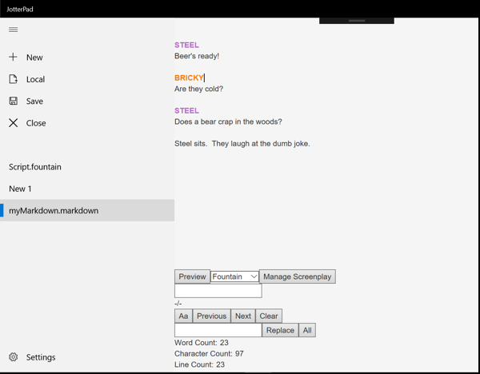

# FountainScriptEditor
A UWP prototype Fountain script editor

This is a UWP application, specialised for people who write Fountain scripts.   
Built as part of a internship project. Due to confidentiality reason, source code viewing only available upon request.

Feature Highlights:

* Toggling between Markdown and Fountain:   
The user can toggle between two languages under both Editor and Preview mode.
* Syntax highlighting   
* Markup style shortcuts   
The user can use keyboard shortcuts to achieve the effects of bold, italic, and strikethrough on any selected text.
* Dynamic Find-and-replace   
* Import and Export  
Support files of type .md, .markdown, .fountain, or .txt.
